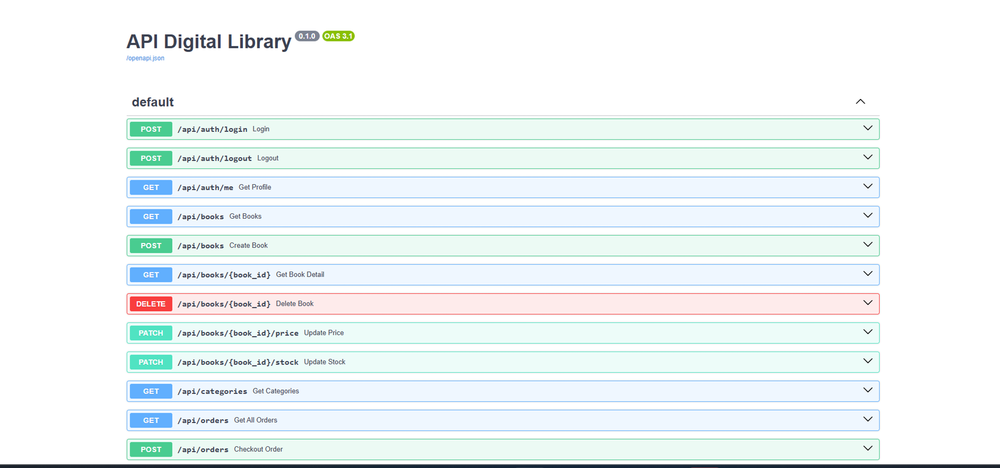
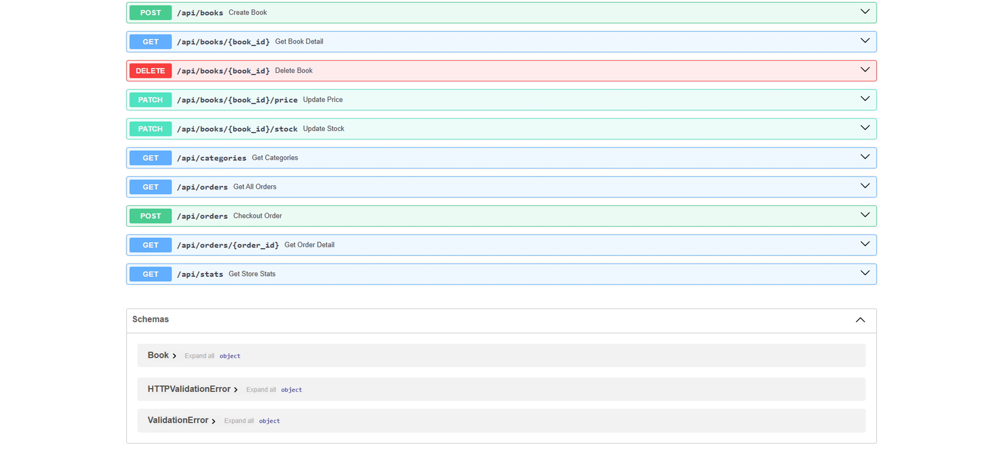
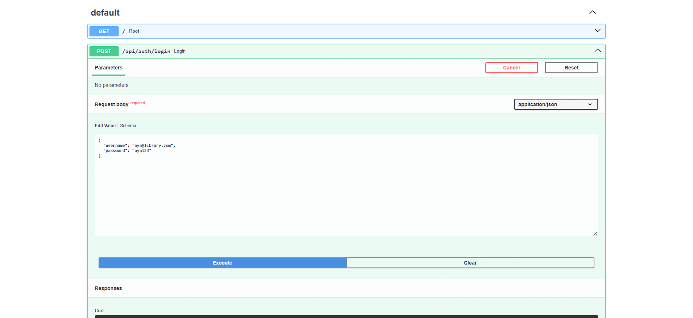
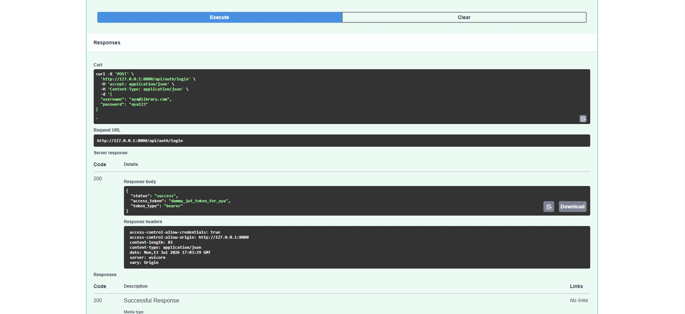

# Digital Library - RESTful API Backend

A robust, production-ready backend API service for a bookstore system built with **FastAPI** and protected by **JWT Authentication**. This project is built as a pure backend service, providing automated, interactive API documentation for frontend consumption or manual testing.

```
backend/             → FastAPI (modular)
├── main.py                 ← entry point, registers all routers
├── database.py             ← in-memory "database" (BOOKS, USERS, ORDERS, TOKENS)
├── requirements.txt
├── models/
│   └── schemas.py          ← Pydantic request/response models
├── routes/
│   ├── auth.py             ← /api/auth/*
│   ├── books.py            ← /api/books/*
│   └── orders.py           ← /api/orders/*
└── utils/
    └── auth.py             ← dependency: get_current_user, require_admin
```

---

## How to Run

### Backend (FastAPI)

```bash
cd back-end
pip install -r requirements.txt
uvicorn main:app --reload
```

Backend runs at `http://localhost:8000`  
Auto API docs (Swagger): `http://localhost:8000/docs`

**Demo account:**
- Email: `aya@library.com`
- Password: `aya123`

---

## API Endpoints

| Method | Endpoint | Description | Auth |
|--------|----------|-------------|------|
| GET | `/api/books` | List books (filter: category, search, sort, min_price, max_price) | ❌ |
| GET | `/api/books/{id}` | Single book detail | ❌ |
| POST | `/api/books` | Add new book | ✅ |
| PATCH | `/api/books/{id}/price` | Update book price | ✅ |
| PATCH | `/api/books/{id}/stock` | Update book stock | ✅ |
| DELETE | `/api/books/{id}` | Delete book | ✅ |
| GET | `/api/categories` | List categories | ❌ |
| POST | `/api/orders` | Checkout / create order | ❌ |
| GET | `/api/orders` | List all orders | ✅ |
| GET | `/api/orders/{order_id}` | Single order detail | ❌ |
| GET | `/api/stats` | Store statistics (revenue, low stock, etc.) | ✅ |
| POST | `/api/auth/login` | Login, get token | ❌ |
| POST | `/api/auth/logout` | Logout | ✅ |
| GET | `/api/auth/me` | Current user info | ✅ |

```
Authorization: Bearer <token_from_login>
```

---

## Features

### Backend
- Product CRUD (create, read, update price/stock, delete)
- Order system with automatic stock validation
- Simple auth (login/logout/token)
- Statistics endpoint (revenue, low stock books, bestsellers)
- Auto Swagger docs at `/docs`

---

## Tech Stack

- **Backend:** FastAPI, Pydantic, Uvicorn
- **Database:** In-memory (Python list/dict)

## Screenshot






## Author
Aah Hayatul Karimah
